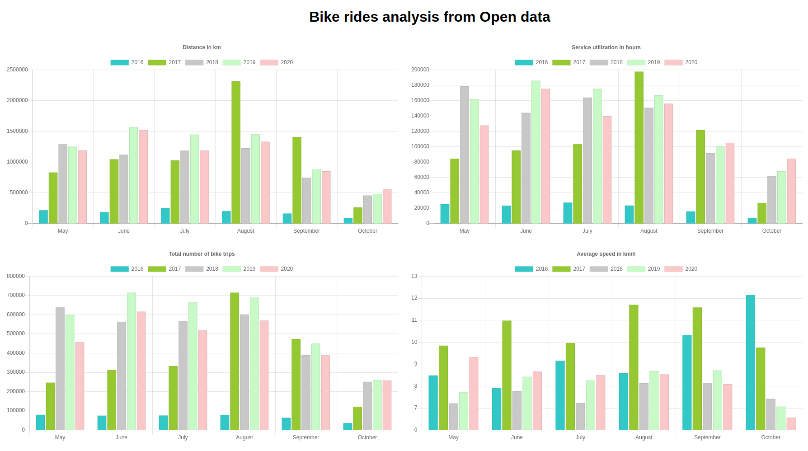

# Bike rides


Proof of concept using OpenData from the Helsinki Open repository (https://classic.hsl.fi/avoindata)

We have used OpenData from public bike transportation to try to prove 2 things:

&nbsp;&nbsp; a) The public bike system adoption is on the rise and increases every year.

&nbsp;&nbsp; b) The people using the public bike system gets more fitted as they use it i.e. the trips average speed should increase.

This project consists of 2 parts:

&nbsp;&nbsp; 1.- Download **all** Helsinki bike trips from years 2016-2020 and parse them summarizing the findings. 

These trips include all data from all trips.
The service is only available from May to October, so we will only look at these months. The yearly data is not included in this repository as it takes up a lot of space, but you can download it from here:
http://dev.hsl.fi/citybikes/od-trips-{year}/od-trips-{year}.zip where {year} can be from 2016 to 2020 values.
The summarized data is included in this repository, so you don't have to worry about generating it. The source code for data summarization can also be found in this repository should be needed.


&nbsp;&nbsp; 2.- Load the summarized data and present it in a visual way to be able to see the findings. We have used chartjs for that: (https://www.chartjs.org/)

### Findings

Below you can see a picture including 4 relevant charts with the summarized data. 

2016 was the beginning of the service, so the amount of users is small and the data not very relevant.

2020 is an atypical year with the coronavirus, so the data from 2020 is not truly comparable with previous years.




Some conclusions:

* People do not get more fit when using the bike system or at least we cannot find a correlation on it.

* Overall 2019 looks like the best year i.e the most used year. There is a trend in using more and more the service.

* Fun fact: 2017 for some strange reason is, by far, the year with the highest average speed. 


## Run the application

This application uses **gradle** as build tool. To run the application execute in Linux/Mac:

```
./gradlew bootRun
```

or if you are using Windows:

```
gradlew.bat bootRun
```

### Using the application

Once you have the application up and running, go to the following URL to see the generated charts:

```
http://localhost:8080
```

